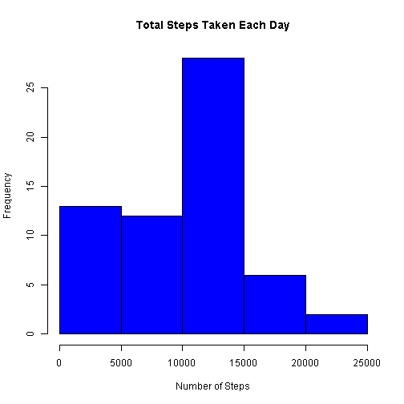
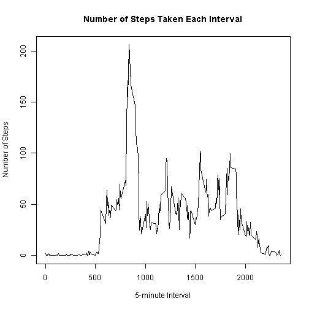
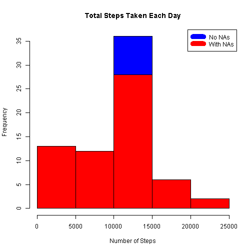
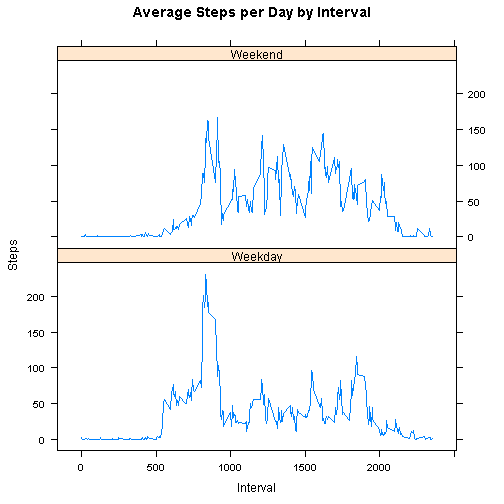

##Loading and preprocessing the data
Download, unzip and load the data.


```r
if(!file.exists("getdata-projectfiles-UCI HAR Dataset.zip")) {
        temp <- tempfile()
        download.file("http://d396qusza40orc.cloudfront.net/repdata%2Fdata%2Factivity.zip",temp)
        unzip(temp)
        unlink(temp)
}

data <- read.csv("activity.csv")
```

##What is mean total number of steps taken per day?

Use summaryBy in package doBy to generate summarizing data, in this case, sum of steps taken each day. 


```r
library(doBy)
```

```
## Loading required package: survival
```

```r
library(survival)
step_day<-summaryBy(steps ~date, FUN=c(sum), data=data, na.rm=TRUE)
hist(step_day$steps.sum, main = "Total Steps Taken Each Day", col="blue", xlab="Number of Steps")
```

 

And then, calculate and print the mean and median number of steps taken per day. 


```r
print(mean_day<-mean(step_day$steps.sum, na.rm=TRUE))
```

```
## [1] 9354.23
```

```r
print(median_day<-median(step_day$steps.sum, na.rm=TRUE))
```

```
## [1] 10395
```

##What is the average daily activity pattern?

Use summaryBy to generate dataset containing mean number of steps taken each interval.
Plot it.
Find the 5-minute interval with the maximum number of steps, and the corresponding steps.


```r
library(doBy)
library(survival)
step_interval<-summaryBy(steps ~interval, FUN=c(mean), data=data, na.rm=TRUE)
plot(step_interval$interval, step_interval$steps.mean, type="l", main="Number of Steps Taken Each Interval", xlab="5-minute Interval", ylab="Number of Steps")
```

 

```r
print(max_step<-max(step_interval$steps.mean, na.rm=TRUE))
```

```
## [1] 206.1698
```

```r
print(max_interval<-step_interval[which.max(step_interval$steps), 1])
```

```
## [1] 835
```

##Imputing missing values
Count the total number of missing values.
Replace NAs with the mean step's number for each interval.

```r
print(NAsum<-sum(!complete.cases(data)))
```

```
## [1] 2304
```

```r
newdata <- transform(data, steps = ifelse(is.na(data$steps), step_interval$steps[match(data$interval, step_interval$interval)], data$steps))
```

Remake the summarizing dataset with our newdata. 
Plot "Total Steps Taken Each Day" using both new and old data sets, so that we can see the differences between them and changes to our data after we impute the dataset.


```r
library(doBy)
library(survival)
newstep_day<-summaryBy(steps ~date, FUN=c(sum), data=newdata)
hist(newstep_day$steps.sum, main = "Total Steps Taken Each Day", col="blue", xlab="Number of Steps")
hist(step_day$steps.sum, main = "Total Steps Taken Each Day", col="red", xlab="Number of Steps", add=T)
legend("topright", c("No NAs", "With NAs"), col=c("blue", "red"), lwd=10)
```

 

Calculate a series of statistics to show the differences between imputed and non-imputed data.


```r
print(newmean_day<-mean(newstep_day$steps.sum))
```

```
## [1] 10766.19
```

```r
print(newmedian_day<-median(newstep_day$steps.sum))
```

```
## [1] 10766.19
```

```r
print(meandifference <- newmean_day-mean_day)
```

```
## [1] 1411.959
```

```r
print(meddifference <- newmedian_day-median_day)
```

```
## [1] 371.1887
```

```r
print(totaldifference <- sum(newstep_day$steps.sum) - sum(step_day$steps.sum))
```

```
## [1] 86129.51
```

##Are there differences in activity patterns between weekdays and weekends?
Create a new variable to indicate the weekday of one specific date using function weekdays.
Recode them to either "Weekday" or "Weekend".
Generate dataset containing mean number of steps taken each interval during weekdays and weekends, respectively.
Plot it.


```r
newdata$day<-weekdays(as.Date(newdata$date))
library(car)
newdata$day<-recode(newdata$day, "c('Monday', 'Tuesday', 'Wednesday', 'Thursday', 'Friday')='Weekday'")
newdata$day<-recode(newdata$day, "c('Saturday', 'Sunday')='Weekend'")
library(doBy)
library(survival)
newstep_interval <- summaryBy(steps ~interval+day, FUN=c(mean), data=newdata)
library(lattice)
xyplot(newstep_interval$steps.mean ~ newstep_interval$interval|newstep_interval$day, main="Average Steps per Day by Interval",xlab="Interval", ylab="Steps",layout=c(1,2), type="l")
```

 

As the plot tells, there's a peak time during weekdays, while during weekends, activities were more spread out.


```r
require(knitr)
opts_chunk$set(echo = TRUE, cache = TRUE, cache.path = "cache/", fig.path = "figure/")
```

